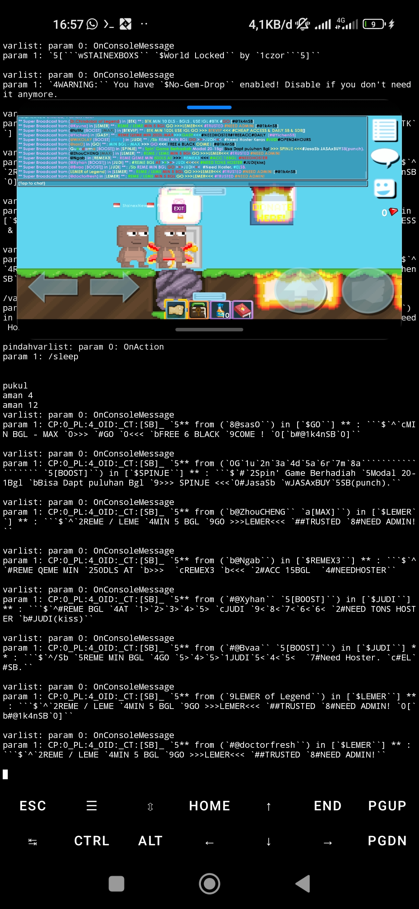

# HEADLESS NETWORK PROTOCOL AUTOMATION CLIENT

A headless C/C++ network automation client designed to operate continuously
from a Linux/Termux terminal environment on resource-constrained hardware.

The project uses ENet for network communication and implements protocol
processing, automated reconnection, multithreaded bot management,
world-state processing, pathfinding, and long-running automation workflows.

> **Project Status:** Personal Project — Actively Used
>
> **Source Code:** Private

---

## Overview

This project is a personal C/C++ network automation client that I developed
and extensively modified from an existing open-source codebase.

When I first encountered the project, I had limited experience with C/C++.
I studied the existing implementation, investigated its networking and
data-processing behavior, and progressively modified and extended it to
meet my requirements.

The resulting system evolved into a headless, multi-instance automation
client capable of operating continuously on resource-constrained hardware.

---

## Key Features

- C/C++ implementation
- ENet-based networking
- Headless terminal operation
- Multi-instance bot execution
- Automated connection and reconnection
- Connection timeout and inactivity detection
- Network packet processing
- World-state data processing
- Character movement and pathfinding
- Automated planting and harvesting
- Automated PNB workflow
- Resource management
- Multithreaded execution
- Mutex-based synchronization
- Memory optimization for low-end hardware
- Long-running 24/7 operation

---

## Technology Stack

| Technology | Purpose |
|---|---|
| C/C++ | Core application |
| ENet | Network communication |
| Linux / Termux | Runtime environment |
| g++ / clang++ | Compilation |
| Bash | Build automation |
| Multithreading | Multiple bot instances |
| Mutex | Shared-data synchronization |

---

## Project Status

The project is actively used as a personal automation system.

The core source code is intentionally kept private because the software
is still actively used.

This repository serves as a technical showcase documenting the architecture,
engineering challenges, development process, and capabilities of the system.

## Demo

### Terminal Operation

The client operates entirely through a terminal interface without requiring
a graphical user interface.

